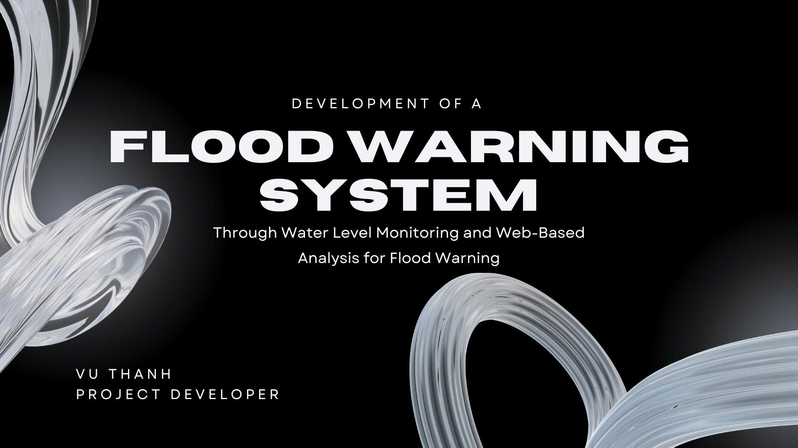
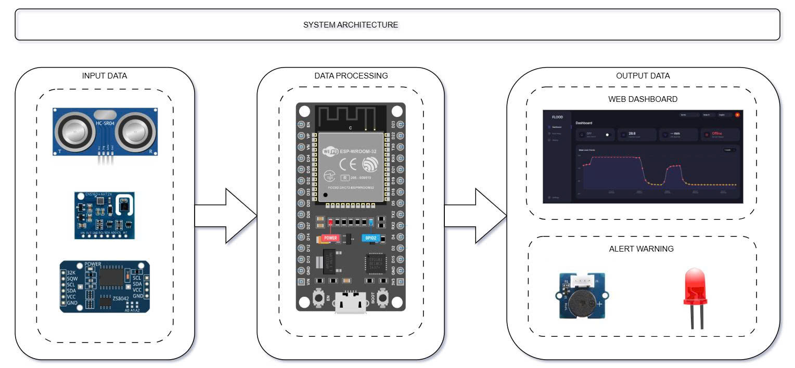
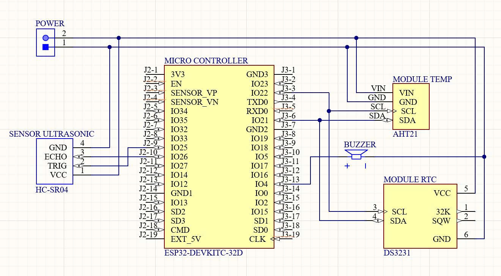

# Flood Warning System: Water Level Monitoring and Web-Based Analysis

*Project Developer: Vu Thanh*

## Introduction
Climate change has made many regions vulnerable to adverse weather conditions such as extreme rainfall and floods. While populations continue to increase, existing infrastructures are often not enough to support communities during severe environmental events. These impacts may intensify exponentially over time, making it critical and urgent to respond and mitigate the environmental implications. 

This project aims to serve as a catalyst for addressing the underlying vulnerabilities in disaster risk reduction management through an early flood warning system, acting as a proactive and preventive approach.

## Objective
The main objective of this study is to develop a flood monitoring and early warning system through continuous water level monitoring and web-based analysis. The system monitors environmental conditions in real-time and provides output through a web dashboard and an alert warning mechanism. Specifically, this project focuses on:
* Designing a suitable hardware prototype using an ESP32 microcontroller and IoT sensors for the warning system.
* Gathering essential sensor data to analyze and understand the local water-level situation.
* Developing an operational warning system utilizing local hardware alerts and a web dashboard for disaster preparedness.

## System Architecture

*Figure 1: System Architecture of the Flood Warning System*

The architecture of the Flood Warning System involves three functional layers:
1. **Input Data Block:** This monitoring layer includes an HC-SR04 ultrasonic sensor for water level detection, an AHT2x sensor for environmental data, and a DS3231 RTC module for real-time clock synchronization.
2. **Data Processing Block:** This core layer utilizes an ESP-WROOM-32 microcontroller to process the incoming sensor data and handle network communications.
3. **Output Data Block:** The processed information is transmitted to a Web Dashboard for data visualization, while a local Alert Warning subsystem (utilizing a buzzer and LED) is activated when critical thresholds are reached.

## Schematic Circuit Diagram

*Figure 2: Schematic Circuit Diagram of the Device*

The hardware implementation is built around the ESP32-DEVKITC-32D board, which interfaces directly with the peripheral modules. The microcontroller processes the sensor data to determine if a flood warning should be issued. The electrical schematic ensures stable power routing and accurate signal processing across the I2C bus (for the AHT21 and DS3231 modules) and GPIO pins (for the HC-SR04 and Buzzer).